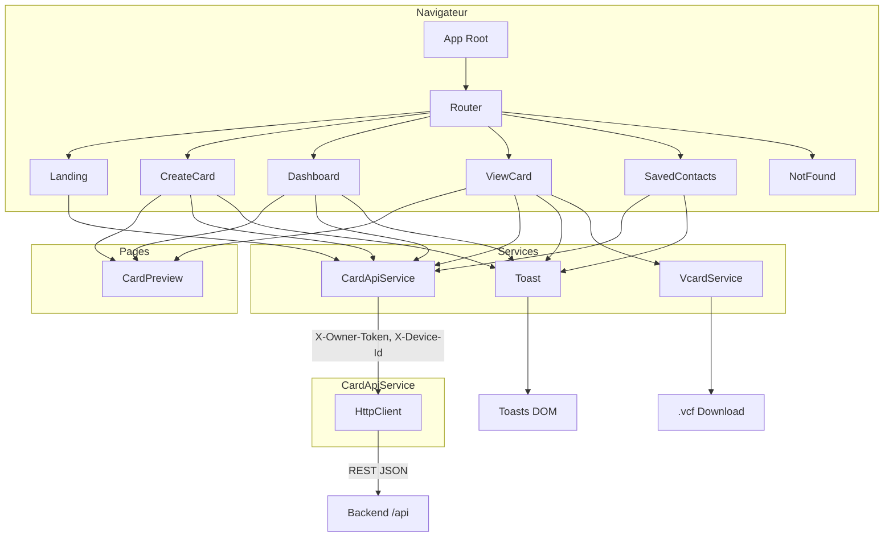
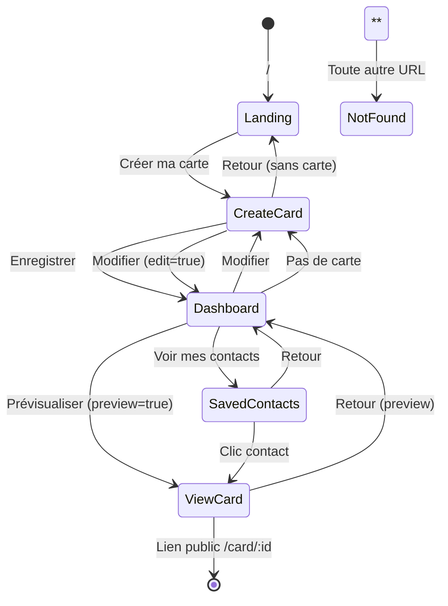
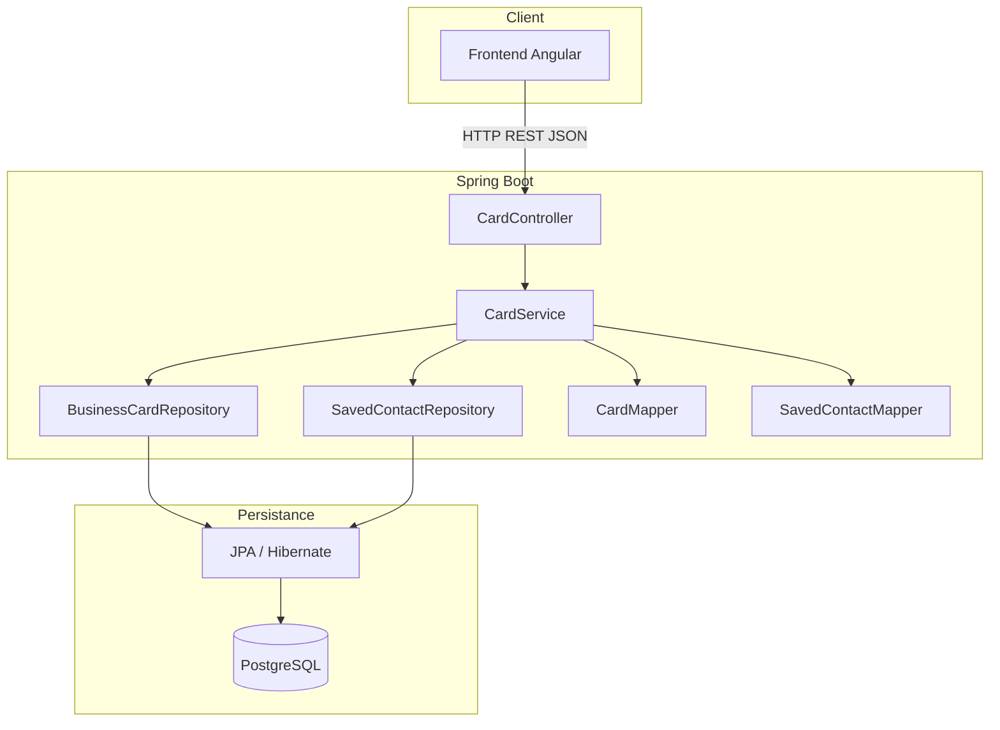
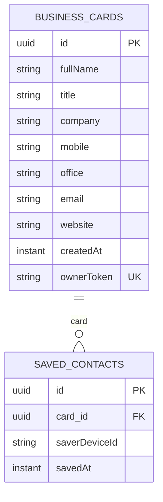
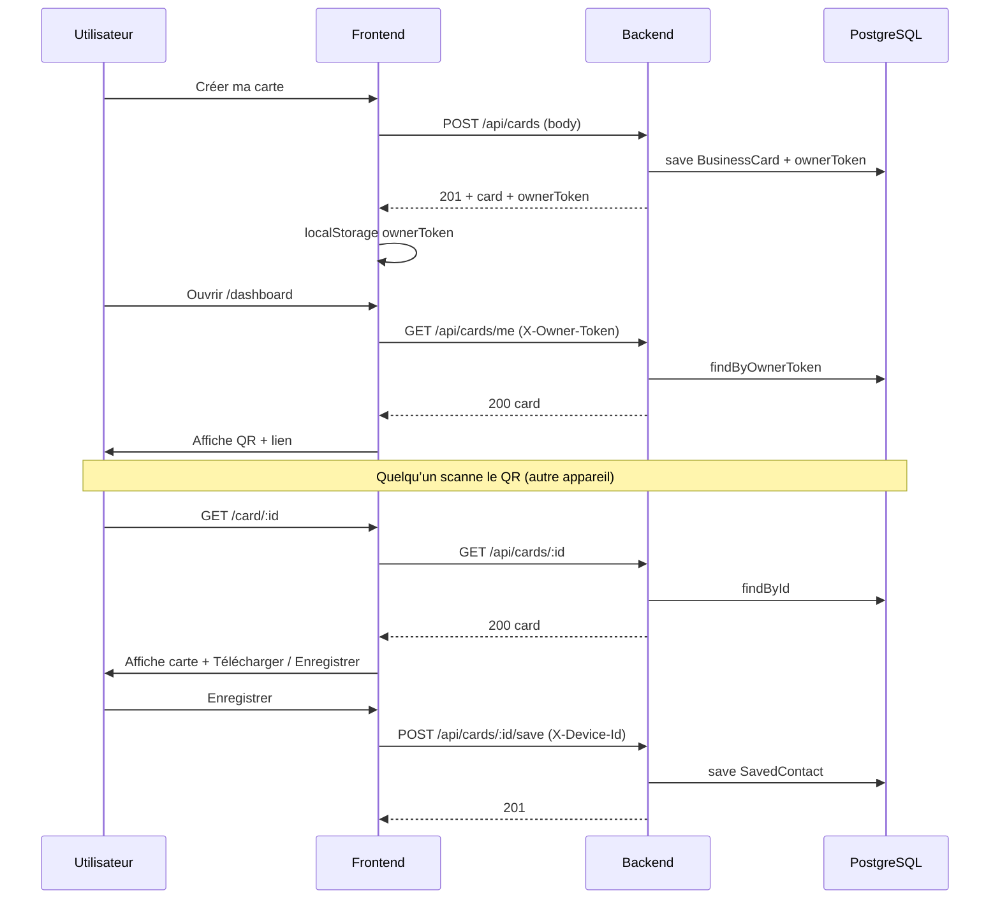

# Architecture – Vcard (Frontend & Backend)

Documentation de l’architecture du frontend Angular et du backend Spring Boot de l’application de cartes de visite numériques.

---

## 1. Vue d’ensemble

| Couche        | Stack                    | Rôle principal                                      |
|---------------|--------------------------|-----------------------------------------------------|
| **Frontend**  | Angular 21, Bootstrap 5  | UI, routage, appels API, génération QR, toasts     |
| **Backend**   | Spring Boot 4, JPA       | API REST, persistance, logique métier               |
| **Base**      | PostgreSQL 16            | Données cartes et contacts                          |

Le frontend communique avec le backend via des requêtes HTTP (JSON). En production Docker, Nginx sert le front et proxy `/api` vers le backend.

---

## 2. Architecture du Frontend (Angular)

### 2.1 Arborescence du projet

```
vcard/
├── src/
│   ├── index.html
│   ├── main.ts
│   ├── styles.css                    # Styles globaux + toasts
│   └── app/
│       ├── app.ts                    # Racine : <router-outlet>
│       ├── app.html
│       ├── app.config.ts             # Router, HttpClient, providers
│       ├── app.routes.ts             # Routes lazy-loadées
│       │
│       ├── core/
│       │   └── environments/
│       │       ├── environment.ts              # Prod : apiBaseUrl = ''
│       │       └── environment.development.ts  # Dev : apiBaseUrl = 'http://localhost:8080'
│       │
│       ├── models/
│       │   └── business-card.ts      # Interfaces BusinessCard, SavedContact
│       │
│       ├── services/
│       │   ├── card-api.service.ts   # Appels HTTP vers le backend (ownerToken, deviceId)
│       │   ├── toast.service.ts      # Notifications toast (success/error/info)
│       │   ├── vcard.service.ts      # Génération et téléchargement .vcf
│       │   └── storage.service.ts     # (Legacy) localStorage, non utilisé avec l’API
│       │
│       ├── components/
│       │   └── card-preview/
│       │       ├── card-preview.component.ts
│       │       ├── card-preview.component.html
│       │       └── card-preview.component.css   # Carte visuelle (fond sombre, contacts)
│       │
│       └── pages/
│           ├── landing/              # /  – Accueil, CTA "Créer ma carte"
│           ├── create-card/          # /create – Formulaire création/édition
│           ├── dashboard/            # /dashboard – Ma carte, QR, lien, actions
│           ├── view-card/            # /card/:id – Vue publique + télécharger/enregistrer
│           ├── saved-contacts/       # /contacts – Liste des contacts enregistrés
│           └── not-found/            # ** – 404
│
├── angular.json
├── package.json
├── Dockerfile
└── nginx.conf                        # Proxy /api vers backend (Docker)
```

### 2.2 Schéma d’architecture (Frontend)



### 2.3 Couches et responsabilités

| Couche        | Fichiers / dossiers        | Rôle |
|---------------|----------------------------|------|
| **Shell**     | `app.ts`, `app.html`, `app.config.ts` | Point d’entrée, `<router-outlet>`, configuration (Router, HttpClient). |
| **Routing**   | `app.routes.ts`            | Définition des routes et lazy loading des pages. |
| **Environnement** | `core/environments/*`  | URL de base de l’API (prod vs dev). |
| **Modèles**   | `models/business-card.ts` | Types TypeScript `BusinessCard`, `SavedContact`. |
| **Services**  | `services/*`              | Logique métier partagée : API, toasts, vCard. |
| **Composants réutilisables** | `components/card-preview/` | Affichage d’une carte (prévisualisation, vue publique). |
| **Pages**     | `pages/*`                  | Écrans par route : formulaire, dashboard, vue carte, contacts, 404. |

### 2.4 Routage et flux utilisateur



| Route          | Composant      | Rôle |
|----------------|----------------|------|
| `/`            | Landing        | Page d’accueil, 3 étapes, CTA vers création. |
| `/create`      | CreateCard     | Formulaire identité + coordonnées ; mode édition si `?edit=true`. |
| `/dashboard`   | Dashboard      | Ma carte, QR, lien de partage, mode partage, prévisualiser, modifier, lien contacts. |
| `/card/:id`    | ViewCard       | Carte publique (lien/QR) ; télécharger .vcf, enregistrer en contact ; mode préview si `?preview=true`. |
| `/contacts`    | SavedContacts  | Liste des contacts enregistrés, recherche, suppression. |
| `**`           | NotFound       | Page 404. |

### 2.5 Technologies frontend

- **Angular** 21 (standalone components, signals, control flow `@if` / `@for`)
- **Router** avec lazy loading par route
- **HttpClient** (fetch) pour les appels API
- **Bootstrap 5** (CDN) + CSS custom (couleurs, toasts, mise en page)
- **angularx-qrcode** pour le QR code
- **RxJS** pour les Observables (services API)

---

## 3. Architecture du Backend (Spring Boot)

### 3.1 Arborescence du projet

```
vcard_api/
├── src/main/
│   ├── java/com/example/vcard_api/
│   │   ├── VcardApiApplication.java      # Point d’entrée Spring Boot
│   │   │
│   │   ├── controller/
│   │   │   └── CardController.java      # REST /api (CORS, headers X-Owner-Token, X-Device-Id)
│   │   │
│   │   ├── service/
│   │   │   └── CardService.java         # Logique métier : création, mise à jour, contacts
│   │   │
│   │   ├── repository/
│   │   │   ├── BusinessCardRepository.java
│   │   │   └── SavedContactRepository.java
│   │   │
│   │   ├── entity/
│   │   │   ├── BusinessCard.java       # Table business_cards
│   │   │   └── SavedContact.java       # Table saved_contacts
│   │   │
│   │   ├── dto/
│   │   │   ├── BusinessCardDto.java
│   │   │   └── SavedContactDto.java
│   │   │
│   │   └── mapper/
│   │       ├── CardMapper.java         # Entity <-> DTO (BusinessCard)
│   │       └── SavedContactMapper.java # Entity -> DTO (SavedContact)
│   │
│   └── resources/
│       ├── application.yml            # Datasource PostgreSQL, JPA
│       └── application-docker.yml     # Optionnel (variables Docker)
│
├── pom.xml
├── Dockerfile.backend
└── docker-compose.yml
```

### 3.2 Schéma d’architecture (Backend)



### 3.3 Couches et responsabilités

| Couche        | Package / classe      | Rôle |
|---------------|----------------------|------|
| **Entrée**    | `VcardApiApplication` | Démarrage Spring Boot. |
| **Présentation** | `controller.CardController` | Exposition REST sous `/api`, lecture des headers `X-Owner-Token` et `X-Device-Id`, CORS. |
| **Métier**    | `service.CardService` | Création/mise à jour de « ma carte », récupération par id (public), enregistrement/suppression de contacts. |
| **Accès données** | `repository.*`     | JPA : requêtes par `ownerToken`, `id`, `saverDeviceId`. |
| **Modèle persistant** | `entity.*`     | Entités JPA mappées sur les tables PostgreSQL. |
| **Contrat API** | `dto.*`           | Objets JSON entrée/sortie (pas d’exposition directe des entités). |
| **Transformation** | `mapper.*`     | Conversion Entity ↔ DTO. |

### 3.4 Modèle de données (backend)



- **BusinessCard** : une carte a un `ownerToken` unique (permettant d’identifier « ma carte » côté frontend).
- **SavedContact** : un enregistrement = une carte sauvegardée par un appareil (`saverDeviceId`) ; unicité `(card_id, saver_device_id)`.

### 3.5 API REST (résumé)

| Méthode | Chemin | Headers | Description |
|--------|--------|---------|-------------|
| POST   | `/api/cards` | — | Créer une carte ; réponse avec `ownerToken`. |
| GET    | `/api/cards/me` | `X-Owner-Token` | Récupérer « ma carte ». |
| PUT    | `/api/cards/me` | `X-Owner-Token` | Mettre à jour « ma carte ». |
| GET    | `/api/cards/{id}` | — | Récupérer une carte par id (public, lien/QR). |
| POST   | `/api/cards/{id}/save` | `X-Device-Id` | Enregistrer la carte dans « mes contacts ». |
| GET    | `/api/cards/{id}/saved` | `X-Device-Id` | Savoir si la carte est déjà enregistrée. |
| GET    | `/api/contacts` | `X-Device-Id` | Liste des contacts enregistrés. |
| DELETE | `/api/contacts/{id}` | `X-Device-Id` | Supprimer un contact. |

### 3.6 Technologies backend

- **Spring Boot** 4 (parent POM)
- **Spring Web MVC** : contrôleurs REST
- **Spring Data JPA** : repositories, entités
- **PostgreSQL** : pilote JDBC
- **Lombok** : getters/setters, builders
- **Java** 17

---

## 4. Interaction Frontend ↔ Backend



- Le frontend stocke **ownerToken** (après création de carte) et **deviceId** (généré une fois) en `localStorage`, et les envoie dans les headers à chaque requête concernée.
- Le **lien partagé** et le **QR** pointent vers `/card/:id` ; le chargement de la carte utilise uniquement `GET /api/cards/{id}` (pas de token requis).

---

## 5. Fichiers de configuration clés

| Fichier | Rôle |
|---------|------|
| **Frontend** | |
| `vcard/src/app/core/environments/environment*.ts` | URL de base de l’API (prod = '', dev = 'http://localhost:8080'). |
| `vcard/angular.json` | Build, fileReplacements pour l’environnement de dev. |
| `vcard/nginx.conf` | En Docker : servir l’app et proxy `/api/` vers le backend. |
| **Backend** | |
| `src/main/resources/application.yml` | Datasource PostgreSQL (variables d’environnement), JPA, port serveur. |
| **Docker** | |
| `docker-compose.yml` | Services `postgres`, `backend`, `frontend` et volume `postgres_data`. |
| `Dockerfile.backend` | Build Maven + image JRE pour l’API. |
| `vcard/Dockerfile` | Build Angular + Nginx pour le frontend. |

---

*Document généré pour le projet Vcard (vcard_api).*
